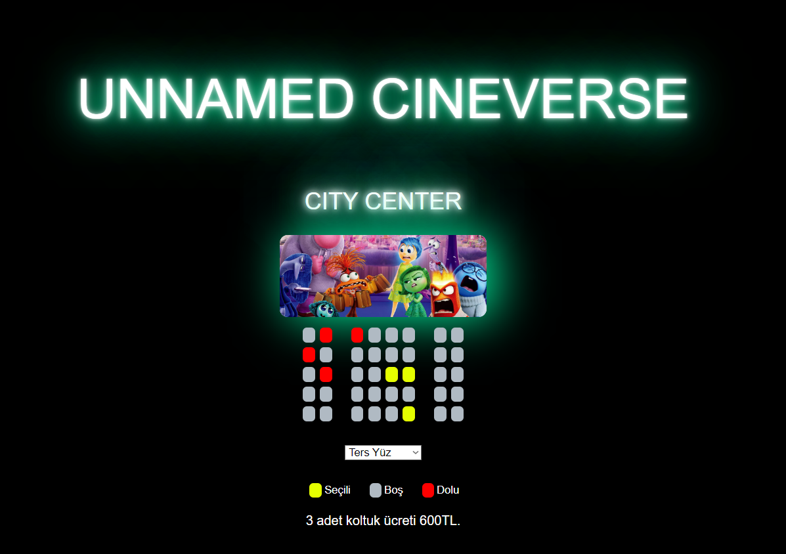

# Ticket-App

Bu proje, kullanıcıların sinema bileti rezervasyonu yapmalarını sağlayan bir web uygulamasıdır. Kullanıcılar, koltukları seçebilir ve seçili koltukların bilgisini local storage üzerinde saklayabilirler. Böylece sayfa yenilendiğinde veya kapatıldığında bile seçimler kaybolmaz.

## Proje Özeti

### Kullanılan Teknolojiler
- HTML
- CSS
- JavaScript
- Local Storage

### Proje Özellikleri
- Koltuk seçimi
- Seçili koltukların local storage'a kaydedilmesi
- Sayfa yenilendiğinde seçili koltukların geri yüklenmesi
- Film seçimi ve bilet ücretinin hesaplanması

